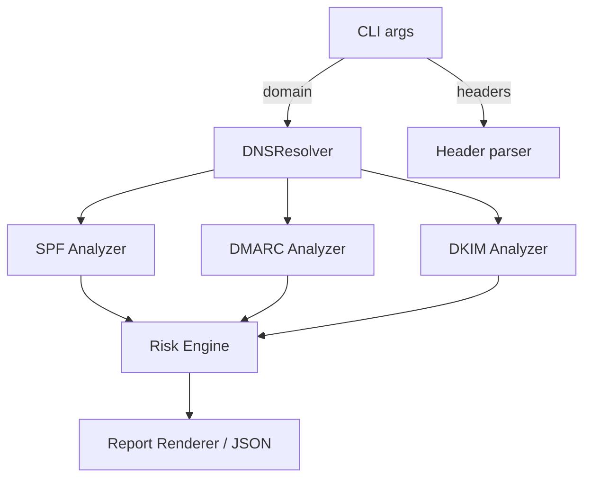

# Email Security Audit (ESAG)

A production-grade command-line tool for auditing email authentication controls (SPF, DMARC, DKIM) and estimating spoofability risk for a domain or real-world message headers.

## Features

- DNS-backed discovery of SPF, DMARC, and DKIM TXT records using `dnspython`.
- Opinionated analysis highlighting weak constructs such as `+all`, soft-fail policies, empty DKIM keys, and excessive SPF lookups.
- Spoofability risk scoring with actionable findings.
- Optional parsing of real email headers to review `Authentication-Results` outcomes.
- JSON report emission for pipelines, plus colorized terminal output powered by `rich`.

## Quickstart

1. **Install dependencies**

   ```bash
   python -m venv .venv
   source .venv/bin/activate
   pip install -r requirements.txt
   ```

   Development extras (linting + tests):

   ```bash
   pip install -r requirements-dev.txt
   ```

2. **Run a domain audit**

   ```bash
   python main.py --domain example.com
   ```

   Produce JSON instead of the rich table:

   ```bash
   python main.py --domain example.com --json
   ```

3. **Inspect email headers**

   ```bash
   python main.py --headers examples/sample_headers.txt --json
   ```

4. **Persist results**

   ```bash
   python main.py --domain example.com --json --output report.json
   ```

Use `--verbose` for debug-level logging and `--selector` to override the DKIM selector (defaults to `default`).

### CLI options

| Flag | Description |
| --- | --- |
| `--domain` | Domain to audit for SPF/DMARC/DKIM deployment. |
| `--selector` | DKIM selector to query (default: `default`). |
| `--headers` | Path to a file containing raw email headers to parse `Authentication-Results`. |
| `--json` | Emit JSON instead of terminal tables. |
| `--output` | Persist JSON results to a file. |
| `--verbose` | Enable debug logging. |

### Makefile shortcuts

- `make install` – install runtime dependencies.
- `make install-dev` – install runtime + development dependencies.
- `make lint` – run `ruff` and `black --check`.
- `make format` – apply formatting with `black`.
- `make test` – execute the pytest suite.

## Spoofability model

- **SPF**
  - `+all`: Critical risk (any sender allowed).
  - `~all`: Medium risk (soft fail) unless paired with other strong controls.
  - `-all`: Preferred when lookup count is under RFC 7208's limit of 10.
  - Lookup-heavy mechanisms (`include`, `a`, `mx`, `ptr`, `exists`, `redirect`) are counted; exceeding 10 triggers a warning.
- **DMARC**
  - `p=none`: High risk (monitor-only).
  - `p=quarantine`: Medium risk.
  - `p=reject`: Low risk (recommended for authoritative protection).
  - Missing `rua`: Reporting blind spot.
- **DKIM**
  - Missing selector: Medium risk (messages cannot authenticate via DKIM).
  - Empty `p=` tag: High risk (record exists without a usable public key).
  - Published key of a known type (`rsa`/`ed25519`): Low, positive signal.
- **Composite**
  - Highest-severity finding sets the overall risk level (HIGH > MEDIUM > LOW).

## Project structure

```
.
├── analyzer.py            # SPF/DMARC/DKIM parsers
├── dns_resolver.py        # Hardened TXT lookups
├── header_analysis.py     # Authentication-Results parsing
├── main.py                # CLI entrypoint
├── report.py              # Terminal + JSON output helpers
├── risk.py                # Spoofability scoring
├── examples/              # Sample headers
├── tests/                 # Unit tests
└── docs/
    ├── API.md             # Module reference
    └── ARCHITECTURE.md    # Data flow and design
```



## Development

- Format with `black` and lint with `ruff` (see `pyproject.toml`).
- Run the test suite via `python -m pytest` or `make test`.
- CI enforces linting and tests for pushes and pull requests.

Contributions are welcome—see [CONTRIBUTING.md](CONTRIBUTING.md) and our [Code of Conduct](CODE_OF_CONDUCT.md).

## Security

Review [SECURITY.md](SECURITY.md) for disclosure guidance. Never submit live customer data in issues.

## License

This project is licensed under the MIT License. See [LICENSE](LICENSE).
